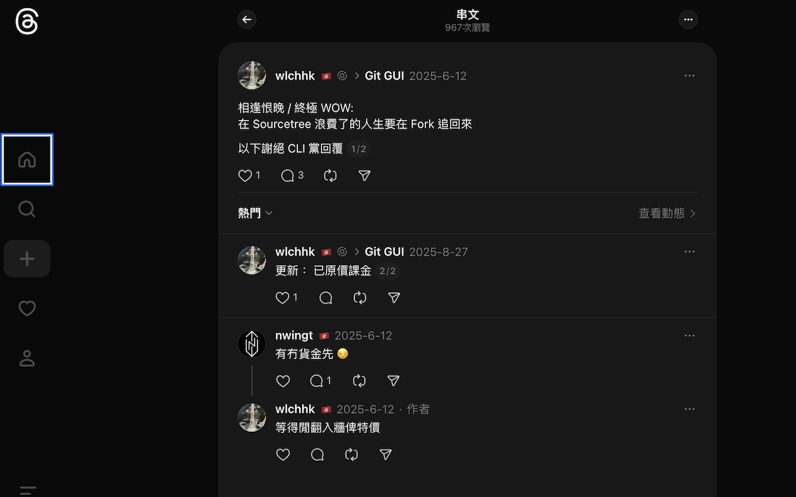

# Threads Country Flags

A Chrome extension that displays country flags next to usernames on Threads.com by leveraging the official Threads API.



## Features

- **Automatic Country Detection**: Fetches country information from user profiles via the Threads API
- **Multilingual Support**: Recognizes country names in multiple languages (English, Chinese, Spanish, French, German, etc.)
- **Smart Performance Optimization**: Only fetches data for links visible in viewport for >1 second using Intersection Observer
- **Efficient Caching**: Persistent storage using chrome.storage.local for cross-session caching
- **Flag Display**: Shows country flag emojis with country name tooltips on hover
- **Request Deduplication**: Prevents duplicate API calls for the same user
- **GraphQL Interception**: Intelligently extracts username→userID mappings from Threads' internal API calls
- **Low Impact**: Minimal performance impact with lazy loading and efficient caching
- **Privacy Focused**: Only uses data already available in public Threads profiles
- **Popup UI**: View statistics (cached countries, storage used) and clear cache

## Installation

### From Source (Development)

1. Clone this repository:
   ```bash
   git clone https://github.com/yourusername/threads-country-flag.git
   cd threads-country-flag
   ```

2. Open Chrome and navigate to `chrome://extensions/`

3. Enable "Developer mode" (toggle in the top-right corner)

4. Click "Load unpacked" and select the `threads-country-flag` directory

5. The extension should now be installed and active!

## Usage

1. Navigate to [Threads.com](https://www.threads.com/)
2. Make sure you're logged in (the extension needs your session to access the API)
3. Country flags will automatically appear next to usernames in:
   - Feed posts
   - User profiles
   - Comments and replies

### Troubleshooting

If flags are not appearing:

1. **Check Console Logs**: Open Chrome DevTools (F12) and check the Console tab for messages starting with `[Threads Country Flags]`
   - You should see interceptor initialization messages
   - Look for "bulk-route-definitions" capture messages
   - Check for country fetch requests and responses

2. **Common Issues**:
   - **Not logged in to Threads**: The extension requires you to be logged in to access the API
   - **No GraphQL data yet**: Scroll through your feed to trigger bulk-route-definitions requests
   - **Privacy settings**: Some users may have hidden their country in privacy settings

3. **Debug Information**:
   The extension logs will show:
   - Username→userID mappings being captured
   - Profile links being observed
   - Country fetch requests and responses
   - Links entering/leaving viewport

## How It Works

### Architecture

The extension uses a sophisticated two-world architecture to bypass CORS restrictions and efficiently gather user data:

**1. XHR Interception (MAIN World)**
- `src/interceptor.js` runs in the page context (MAIN world) to intercept XHR requests
- Captures `/bulk-route-definitions` requests that contain username→userID mappings
- Extracts session parameters (fb_dtsg, lsd, etc.) for authenticated API calls
- Example mapping: `@username` → `63128092830`

**2. API Calls (MAIN World)**
- `src/api-injected.js` runs in page context to make API requests with the page's cookies
- Fetches country data from Threads' "About This Profile" API endpoint
- Bypasses CORS by running in the same context as Threads.com

**3. Flag Injection (ISOLATED World)**
- `src/content.js` runs in isolated context for safe DOM manipulation
- Communicates with MAIN world scripts via custom events
- Uses Intersection Observer to only fetch data for links visible in viewport >1 second
- Injects flag emojis with country name tooltips next to usernames
- Skips profile pictures, headers, and already-processed links

**4. Performance Optimizations**
- **Lazy Loading**: Only processes links that have been in viewport for >1 second
- **Request Deduplication**: Prevents multiple simultaneous requests for the same user
- **Persistent Caching**: Stores country data in chrome.storage.local across sessions
- **Smart Filtering**: Skips images, SVGs, and H1 elements to avoid profile pictures

**Components:**
- **Interceptor** (`src/interceptor.js`): XHR interceptor running in MAIN world to capture GraphQL data
- **API Injected** (`src/api-injected.js`): API client running in MAIN world to make authenticated requests
- **Content Script** (`src/content.js`): DOM observer and flag injector with country mappings
- **Background Worker** (`src/background.js`): Handles cache clearing messages
- **Popup UI** (`src/popup.html`, `src/popup.js`): Statistics display and cache management

### Caching Strategy

The extension uses persistent storage for efficient caching:

1. **In-Memory Map**: Stores username→userID mappings and country data during the session
2. **Persistent Storage**: Uses `chrome.storage.local` to persist country data across sessions
3. **Request Deduplication**: Tracks pending requests to avoid duplicate API calls

This approach minimizes API calls and provides instant flag display for previously-seen users.

### API Integration

The extension uses the Threads "About This Profile" API endpoint:
```
https://www.threads.com/async/wbloks/fetch/?appid=com.bloks.www.text_post_app.about_this_profile_async_action
```

It extracts country information from the response and respects user privacy settings (only shows flags if the user has made their country public).

## Development

### Project Structure

```
threads-country-flags/
├── manifest.json              # Chrome extension manifest (MV3)
├── src/
│   ├── interceptor.js        # XHR interceptor (MAIN world)
│   ├── api-injected.js       # API client (MAIN world)
│   ├── content.js            # Content script with country mappings (ISOLATED world)
│   ├── background.js         # Service worker for cache management
│   ├── popup.html            # Extension popup UI
│   ├── popup.js              # Popup logic (statistics & cache clearing)
│   └── styles.css            # Custom styles for flags
├── icons/
│   ├── icon16.png            # 16x16 icon
│   ├── icon48.png            # 48x48 icon
│   └── icon128.png           # 128x128 icon
├── README.md                  # This file
├── CLAUDE.md                  # Project architecture documentation
├── INSTALL.md                 # Installation guide
└── DEVELOPMENT.md             # Development notes
```

### Building

No build step is required. The extension uses vanilla JavaScript (no ES modules in content scripts for MV3 compatibility).

### Adding Country Mappings

To add support for more country names or languages, edit the `COUNTRY_MAPPINGS` object in `src/content.js`:

```javascript
const COUNTRY_MAPPINGS = {
  // ...existing mappings
  'deutschland': 'DE',  // Add new mapping
  '德国': 'DE',         // Chinese for Germany
};
```

The extension currently supports 50+ countries with multilingual names including:
- English, Chinese (Simplified & Traditional), Spanish, French, German, Portuguese, and more

## Future Enhancements

- Firefox and Safari support (multi-browser manifests)
- User-configurable flag display options
- Settings to enable/disable on specific sections
- Support for custom flag designs
- Performance analytics

## Privacy

This extension:
- Only accesses data already publicly visible on Threads.com
- Does not collect or transmit any user data
- Uses your existing Threads session for API authentication
- Stores country data locally for caching purposes only

## Contributing

Contributions are welcome! Please feel free to submit issues or pull requests.

## License

MIT License - see LICENSE file for details

## Disclaimer

This is an unofficial extension and is not affiliated with, endorsed by, or sponsored by Meta Platforms, Inc. or Threads.
