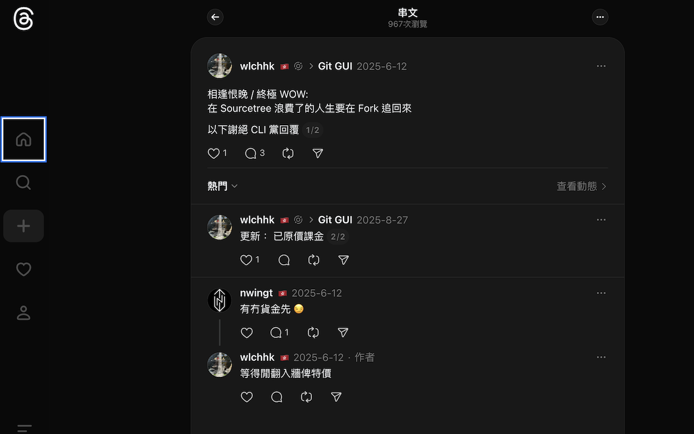

# Threads Country Flags

A Chrome extension that displays country flags next to usernames on Threads.com by leveraging the official Threads API.



**[📺 Watch Video Demo](https://www.youtube.com/watch?v=pIdZ5TT0iMA)**

## Features

- **Country Flags**: Automatically fetches and displays country flag emojis next to usernames
- **Multilingual**: Recognizes ~150 countries in English, Chinese (Simplified & Traditional), Spanish, French, German, and native names
- **Pirate Flag**: Shows 🏴‍☠️ when users explicitly hide their country
- **New User Badge**: Displays 🔰 for accounts created within the last 60 days
- **Smart Performance**: Only fetches data for links visible in viewport >1 second (Intersection Observer + lazy loading)
- **Persistent Caching**: Cross-session caching via chrome.storage.local with request deduplication
- **Privacy Focused**: Only uses data already available in public Threads profiles
- **Popup UI**: View statistics (cached countries, storage used) and clear cache

## Installation

1. Clone this repository:
   ```bash
   git clone https://github.com/williamchong/threads-country-flags.git
   cd threads-country-flags
   ```

2. Open Chrome and navigate to `chrome://extensions/`

3. Enable "Developer mode" (toggle in the top-right corner)

4. Click "Load unpacked" and select the repository directory

5. The extension should now be installed and active!

## Usage

1. Navigate to [Threads.com](https://www.threads.com/) and make sure you're logged in
2. Country flags will automatically appear next to usernames in feed posts, profiles, and comments
3. Hover over a flag to see the full country name

### Troubleshooting

If flags are not appearing:

1. **Check Console Logs**: Open DevTools (F12) → Console tab, look for messages starting with `[Threads Country Flags]`
2. **Common Issues**:
   - **Not logged in**: The extension requires an active Threads session
   - **No data yet**: Scroll through your feed to trigger bulk-route-definitions requests
   - **Pirate flag 🏴‍☠️**: User has hidden their country in privacy settings
   - **New user badge 🔰**: Account created within the last 60 days
   - **Flags show as letter pairs ("US", "JP")**: The browser has no flag glyphs (Chrome on Windows). The extension bundles a font for this; if letters persist, an anti-fingerprinting setting may be blocking the canvas check that detects it

## How It Works

The extension uses a two-world architecture (MAIN + ISOLATED) required by Chrome's Manifest V3:

**1. XHR Interception (MAIN World)** — `src/interceptor.js` runs in the page context to intercept XHR requests. It captures `/bulk-route-definitions` responses that contain username→userID mappings, and extracts session parameters (fb_dtsg, lsd, etc.) for authenticated API calls.

**2. Country API (MAIN World)** — `src/api-injected.js` runs in the page context to make API requests with the page's cookies. It fetches country and join date data from Threads' "About This Profile" endpoint, bypassing CORS by sharing the page's origin.

**3. Flag Injection (ISOLATED World)** — `src/content.js` runs in isolated context for safe DOM manipulation. It uses an Intersection Observer to detect profile links visible in the viewport for >1 second, deduplicates requests per user, and injects flag emojis with country name tooltips. Country names in any language are mapped to ISO codes via a ~150-country multilingual lookup table.

**4. Caching** — In-memory LRU caches (1000 usernames, 500 countries) for the session, plus persistent `chrome.storage.local` across sessions. "No country" results are cached with a 1-day TTL to avoid repeated API calls.

## Privacy

This extension:
- Only accesses data already publicly visible on Threads.com
- Does not collect or transmit any user data
- Uses your existing Threads session for API authentication
- Stores country data locally for caching purposes only

## Contributing

Contributions are welcome! Please feel free to submit issues or pull requests.

## License

MIT License - see LICENSE file for details

This extension bundles **Twemoji Country Flags** (`src/flag-font.css`, built from
`vendor/TwemojiCountryFlags.woff2`) to supply flag glyphs on platforms that lack
them. The font is built by [TalkJS](https://github.com/talkjs/country-flag-emoji-polyfill)
(MIT); its flag artwork comes from [Twemoji](https://github.com/twitter/twemoji)
and is used under [CC-BY 4.0](https://creativecommons.org/licenses/by/4.0/).
See `vendor/TwemojiCountryFlags.LICENSE.md`. The colour-glyph detection in
`src/content.js` is adapted from the same project.

## Disclaimer

This is an unofficial extension and is not affiliated with, endorsed by, or sponsored by Meta Platforms, Inc. or Threads.
